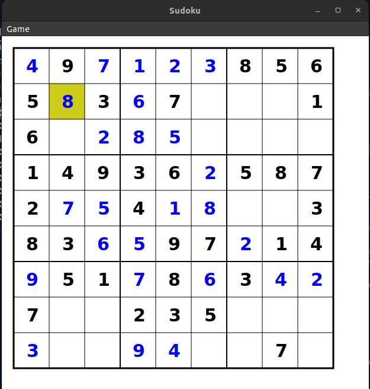
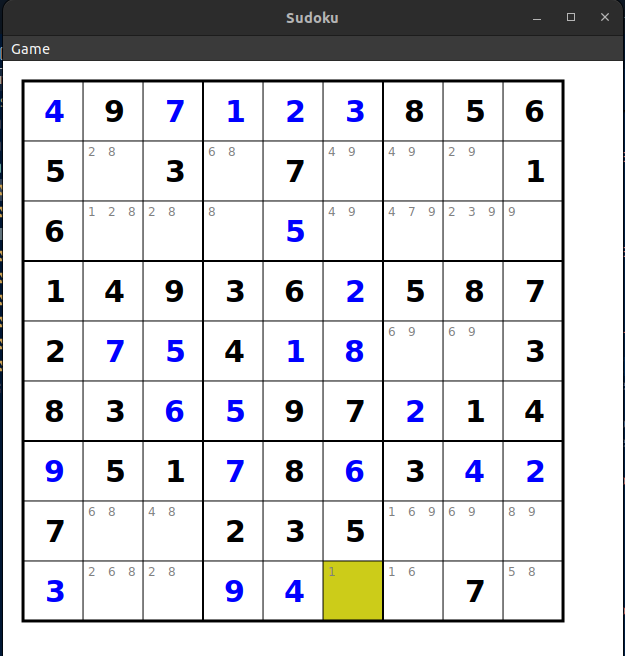
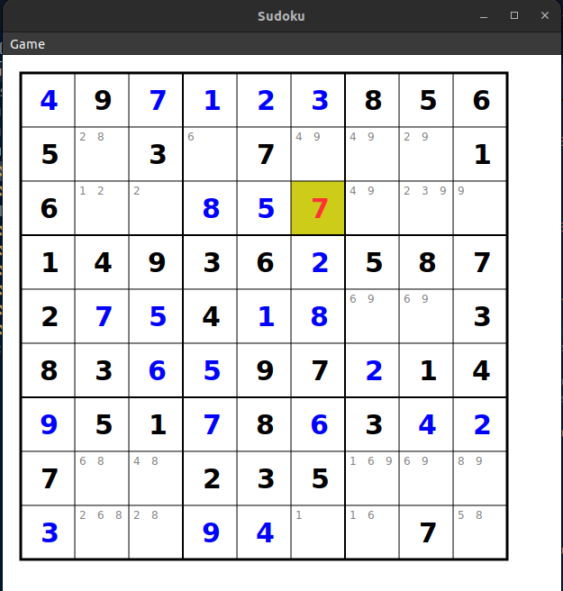
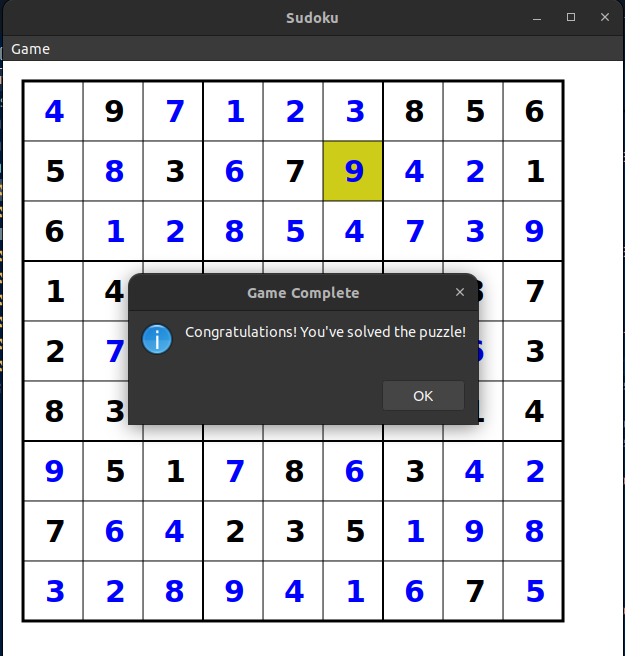

# Sudoku OCaml

A Sudoku game implementation in OCaml with a GTK-based graphical user interface. This project demonstrates functional programming principles and OCaml's capabilities in creating interactive applications.

<figure>
  
  <figcaption>Figure 1: Initial game board with empty cells and fixed numbers</figcaption>
</figure>

<figure>
  
  <figcaption>Figure 2: Game board with hints showing possible numbers for each empty cell</figcaption>
</figure>

<figure>
  
  <figcaption>Figure 3: Game board showing an invalid move highlighted in red</figcaption>
</figure>

<figure>
  
  <figcaption>Figure 4: Completed game board with all cells correctly filled</figcaption>
</figure>

## Features

- **Graphical User Interface**: Built with GTK and Cairo for smooth rendering
- **Multiple Difficulty Levels**: Easy, Medium, and Hard puzzles
- **Smart Hints System**: Shows possible valid numbers for each cell
- **Input Validation**: Real-time validation of moves
- **Game State Tracking**: Tracks invalid moves and game completion
- **Responsive Design**: Adapts to window resizing
- **Cross-Platform**: Works on Linux, macOS, and Windows

## Prerequisites

- OCaml (version 4.14.0 or later)
- OPAM (OCaml Package Manager)
- GTK3 development libraries
- Cairo graphics library
- Dune build system

## Installation

1. Install OCaml and OPAM:
```bash
# Ubuntu/Debian
sudo apt-get install opam

# macOS
brew install opam
```

2. Initialize OPAM:
```bash
opam init
eval $(opam env)
```

3. Install required packages:
```bash
opam install dune lablgtk3 cairo2-gtk
```

5. Build the project:
```bash
dune build
# or using Makefile
make
```

## Running the Game

To start the game:
```bash
dune exec bin/main.exe
# or using Makefile
make sudoku
```

## Game Controls

- **Mouse**: Click to select cells
- **Number Keys (1-9)**: Enter numbers in selected cells
- **Backspace/Delete**: Clear selected cell
- **Menu Options**:
  - New Game: Start a new puzzle
  - Difficulty Selection: Choose puzzle difficulty
  - Show Hints: Toggle display of possible numbers
  - Quit: Exit the game

## Project Structure


```
Sudoku_OCaml/
├── bin/
│   └── main.ml           # Main entry point
├── lib/
│   ├── board.ml          # Board data structure and rendering
│   ├── generate_board.ml # Puzzle generation
│   ├── solve.ml          # Game logic and validation
│   └── ui.ml             # User interface
└── test/
    └── test_Soduku_OCaml.ml  # Test suite
```
